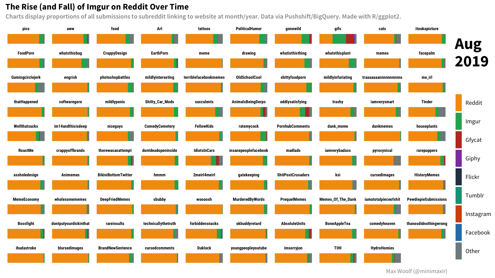

# reddit-imgur-animation

R + ggplot2 code for an animation of Imgur's decline on Reddit in favor of Reddit's self-hosted image service.

The BigQuery to obtain the Reddit data (`bq-results-20191118-212500-yb2czgmcbqno.csv`) is available in the SQL file `subreddit_image_domains.sql`.

## Maintainer/Creator

Max Woolf ([@minimaxir](https://minimaxir.com))

*Max's open-source projects are supported by his [Patreon](https://www.patreon.com/minimaxir). If you found this project helpful, any monetary contributions to the Patreon are appreciated and will be put to good creative use.*

## License

MIT
